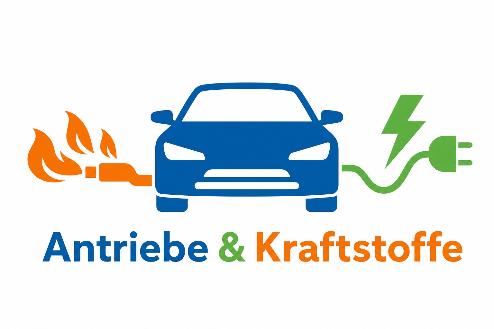

# 🚗⚡ Antriebe & Kraftstoffe – Technik Kl. 8

> Unterrichtseinheit zu Verbrennungsmotor & Elektroantrieb mit Lehrerexperiment (Isopropanol‑Verbrennung)

<p align="center">
  
</p>

---

## 🎯 Überblick

Dieses Paket enthält eine komplette Doppelstunde für das Fach **Technik**, Klasse **8** (Sek I, BW), Inhaltsbereich **Mobilität / Antriebssysteme**:

- Vergleich **Verbrennungsmotor vs. Elektroantrieb**
- **Energieketten** für verschiedene Fortbewegungsarten
- **Stationenarbeit** mit differenzierten Aufgaben (G/M/E)
- **Lehrerexperiment** zur explosionsartigen Verbrennung von Isopropanoldampf (Kolbenmodell, kein Projektil)
- Reflexion und Kurztest zur Lernstandserhebung

Tags: `#Technik` `#Klasse8` `#Antriebe` `#Kraftstoffe` `#Verbrennungsmotor` `#Elektromobilität`

---

## 🧩 Bausteine der Einheit

- **Verlaufsplan** (Doppelstunde, ca. 90 min)
- **Lehrerexperiment**: Isopropanol‑Verbrennung im transparenten Kolbenmodell (nur Demoversuch)
- **AB 1 – Energieketten** (Fahrrad, Verbrenner, Elektroauto)
- **AB 2 – Stationenarbeit**
  - Station 1: Verbrennungsmotor & Lehrerexperiment
  - Station 2: Elektroantrieb
  - Station 3: Vergleich & Bewertung
- **AB 3 – Sicherung & Reflexion** (Vergleichstabelle + Kurztest)

---

## 🧪 Sicherheits-Hinweise (Isopropanol‑Versuch)

- **Nur Lehrerexperiment!**
- Sehr kleine Menge Isopropanol (2–3 Tropfen), kein Projektil, kein geschlossenes Metallrohr.
- Verwendung eines **druckstabilen Kunststoffzylinders** mit Kolben, der Überdruck entweichen lässt.
- Durchführung idealerweise im **Abzug** oder hinter einer stabilen **Plexiglas‑Schutzscheibe**.
- **Schutzbrille**, feuerfeste Unterlage, **Feuerlöscher/Löschdecke** bereit halten.
- Versuch in der **Gefährdungsbeurteilung** dokumentieren und mit **Sicherheitsbeauftragtem/Fachschaft** abstimmen.

> 💡 Nutze den Versuch explizit zur thematischen Abgrenzung: **Warum sind „Kartoffelkanonen“ und ähnliche Konstruktionen im Schulkontext (rechtlich & sicherheitstechnisch) tabu?**

---

## 📚 Didaktischer Fokus

- Aufbau und Wirkungsweise von **Verbrennungsmotor** und **Elektroantrieb**.
- Darstellung von **Energieketten** (chemische / elektrische Energie → Bewegungsenergie).
- Vergleich nach Kriterien:
  - Wirkungsgrad / Energieverbrauch
  - Abgase / Umweltbelastung
  - Lärm
  - Reichweite / Betankungs- bzw. Ladezeit
  - Technikaufwand / Wartung
- Bewertung: **Welcher Antrieb ist wofür geeignet?** (Stadtverkehr, Fernverkehr, Lieferdienste …)

---

## 🕒 Ablauf der Doppelstunde (Kurzüberblick)

```text
1. Einstieg (10 min)
   Bilder/Videos zu Verbrenner & Elektroauto, Brainstorming „Antriebe/Kraftstoffe“.

2. Input (10 min)
   Energieketten & Grundbegriffe Verbrennungsmotor / Elektroantrieb.

3. Stationenarbeit (40–45 min)
   Station 1: Verbrennungsmotor & Lehrerexperiment (Isopropanol‑Kolbenmodell)
   Station 2: Elektroantrieb (DC‑Motor + Batterie)
   Station 3: Vergleich & Bewertung (Kriterien-Tabelle)

4. Sicherung (15 min)
   Gemeinsamer Tafelvergleich, Übertragung in AB 3.

5. Reflexion/Test (10 min)
   Kurzschrifliche Vergleichs- und Bewertungsaufgabe (geeignet als kleiner Leistungsnachweis).
```

---

## 📄 Dateien in diesem Paket

- `Verlaufsplan_Antriebe_Kl8.md`
- `Lehrerexperiment_Isopropanol.md`
- `AB1_Energieketten.md`
- `AB2_Stationen.md`
- `AB3_Vergleich_Reflexion.md`

> Tipp: Lege dir für die Klasse einen eigenen Ordner (z. B. in Nextcloud/OneDrive/GitHub) an und packe alle Dateien plus ggf. Präsentationsfolien hinein.

---

## 🛠️ Anpassungsideen

- Ergänze eigene **Bilder/GIFs** zu Motoren und E‑Autos.
- Passe die **Differenzierung** an deine Lerngruppe an (mehr Hilfestellung für G‑Niveau, Zusatzaufträge für E‑Niveau).
- Ergänze eine weitere Stunde zu **Hybrid- und Brennstoffzellenfahrzeugen**.

Viel Erfolg und Spaß beim Unterrichten! ✨
